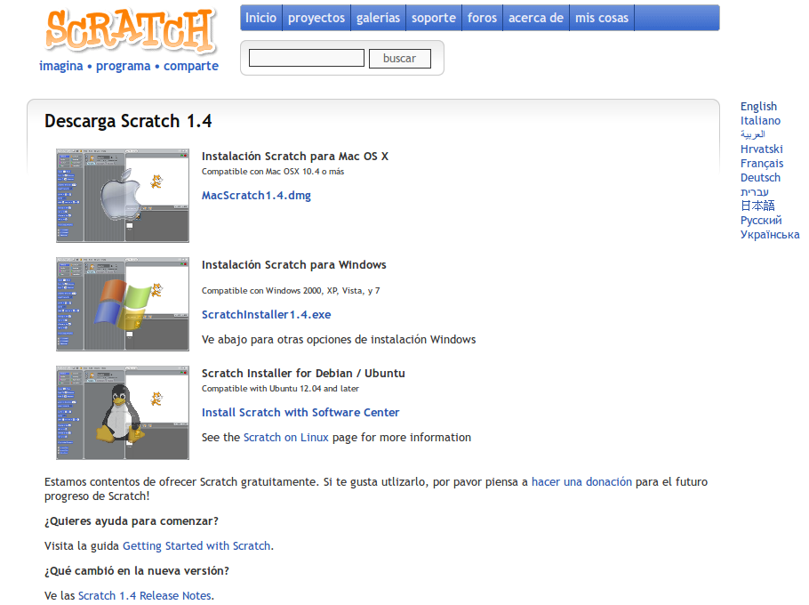
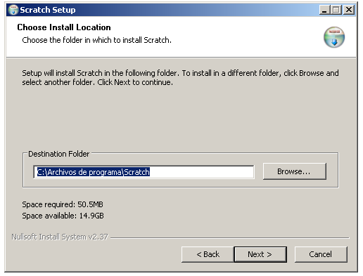
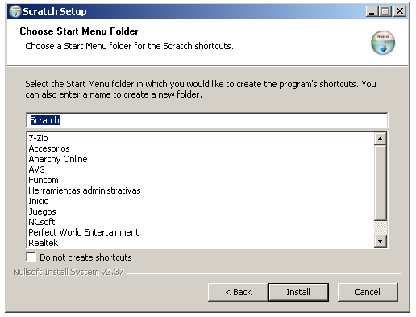
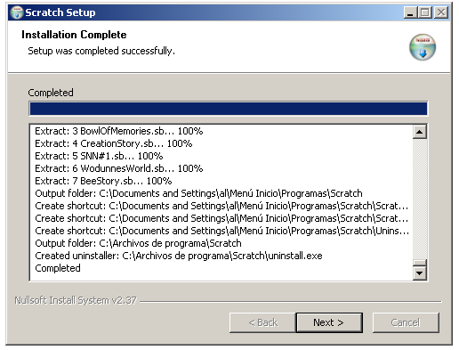
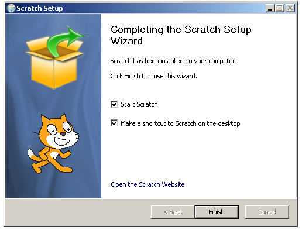
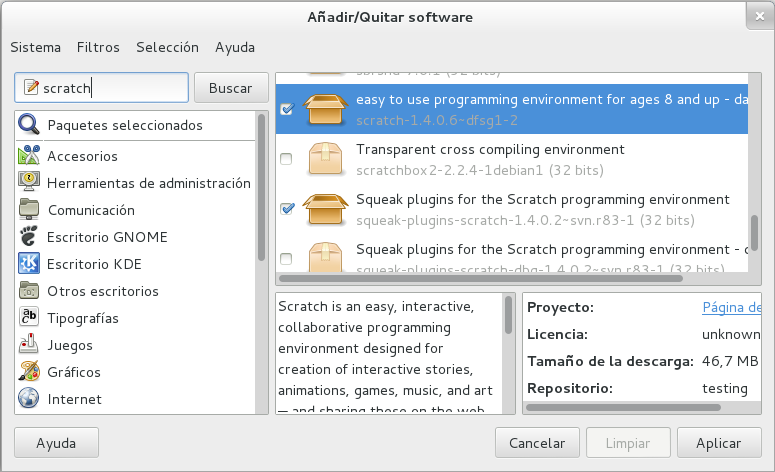

# Instalando Scratch

Scratch es gratuito, y puede descargarse desde la propia página que el MIT tiene dispuesto para ello.

[Página de descarga de Scratch](http://scratch.mit.edu/scratch_1.4/ "Página de descarga de Scratch")



Como se puede ver, en esa página hay versiones para instalar en los sistemas operativos más conocidos, como son Windows, Mac OS X, GNU/Linux.

**NOTA**: En caso de que no se muestre la página en español desde un principio, es posible seleccionar el idioma en la lista que aparece a la derecha.

Naturalmente, para poder instalar Scratch en nuestro ordenador debemos descargar la versión correspondiente al sistema operativo que estemos usando.

**NOTA**: En el caso de sistemas Linux como Ubuntu o Debian, este paso no es necesario, ya que resulta mucho más cómodo, en lugar de descargar la aplicación, usar nuestro gestor de paquetes favorito y, de este modo, instalarlo como se suele hacer con el resto de aplicaciones de estos sistemas.

**NOTA**: Hay dos versiones actualmente de Scratch, optamos por usar para el curso la versión 1.4 ya que es una versión estable. Si decides usar la nueva versión de Scratch la interfaz cambia, tenlo en cuenta ya que hay secciones que se llaman de forma distinta o se acceden de otra forma.

## Instalación en Windows
Como hemos visto, el primer paso es descargar la versión para Windows desde la página oficial de descarga.

[](http://scratch.mit.edu/scratch_1.4/ "Página de descarga de Scratch")

Dependiendo de la velocidad de nuestra conexión, esto puede tardar un rato.

Una vez descargado, iremos a la carpeta donde lo hayamos guardado y ejecutamos le instalador haciendo doble click en su icono.


Al hacerlo, se nos mostrará un asistente que, a lo largo de unas pocas pantallas, nos irá indicando los pasos necesarios y nos dará opción a cambiar algunos de los parámetros (en principio, no es necesario cambiar nada y se puede instalar perfectamente con los valores por defecto).


La primera pantalla es simplemente una presentación del programa y, de la misma forma que haremos con las siguientes, sólo hay que pulsar la flecha de abajo a la derecha para continuar.



La segunda pantalla nos permite cambiar, si queremos, el directorio de instalación del programa. Ya hay uno predefinido por defecto que no es necesario modificar.



La tercera pantalla sirve para elegir el nombre que tendrá la carpeta del menú Inicio que albergará a Scratch. Al igual que antes, no es necesario cambiar el valor por defecto.



Si continuamos, comenzará la instalación propiamente dicha, y una ventana nos irá mostrando los archivos que se copian y tora serie de datos de la propia instalación.


Cuando haya terminado, podemos continuar y, en la última pantalla, nos da opción a crear un acceso directo en el escritorio y también nos permite ejecutar el programa al finalizar. 

Y, con esto, ya estará Scratch instalado en nuestro ordenador.

## Instalación en Mac OSX
Instalar Scratch en Mac OSX es muy sencillo.

Para ello es necesario, como ya hemos visto, descargar la versión del instalador para este sistema operativo desde la página oficial de Scratch. 

[Página de descarga de Scratch](http://scratch.mit.edu/scratch_1.4/ "Página de descarga de Scratch")

Dependiendo de la velocidad de nuestra conexión a Internet esto puede tardar un rato.

Una vez descargado y al hacer doble click sobre el icono, se mostrara una nueva unidad en la columna izquierda del finder (en el apartado "Dispositivos"). 

Abriendo esa unidad se encuentra el instalador propiamente dicho, que sólo hay que ejecutar para que se instale en nuestro sistema. 

## Instalación en GNU/Linux
El procedimiento para instalar Scratch en GNU/Linux es muy simple, pero varía ligeramente dependiendo de la distribución concreta de que se trate:

En distribuciones como Debian o Ubuntu es fácil hacerlo por medio del instalador gráfico (depende de la versión exacta, pero es la aplicación llamada "centro de software", "agregar software", o algo parecido). En Debian, por ejemplo, el aspecto que tiene es este:



Esta aplicación tiene un buscador en el que sólo debemos escribir "scratch" y pulsar en el icono de buscar (una lupa, normalmente). Se se nos mostrará una lista entre la que encontraremos el programa. Sólo tenemos que seleccionarlo e instalarlo. El ordenador, tras pedirnos nuestra contraseña, hará todo el trabajo necesario.

También se puede instalar en modo de texto, que resulta algo menos estético pero quizás más cómodo y rápido. Para ello hay que abrir un terminal y escribiendo la siguiente orden:

```
sudo aptitude install scratch
```

El sistema pedirá nuestra contraseña y, cuando se la demos, buscará el programa y todo lo necesario para instalarlo, nos pedirá confirmación (sólo hay que pulsar "intro" para aceptar) y pasará a instalarlo.

Sea cual sea el método que hayamos usado, ya tendremos el programa instalado, y podemos pasar a ver su uso.
