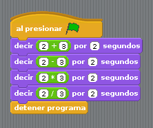
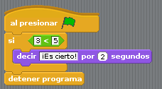

# Operadores
Un operador es un bloque que hace una "operación". Es decir, que trata una o más variables y retorna un valor. Por ejemplo, como veremos en la siguiente página, una suma se hace mediante un operador.

Hay dos tipos básicos de operadores:
* Por un lado tenemos los operadores aritmético y de cadena, que son los que retornan un valor como si se tratase de una variable (y que tienen los extremos redondeados).
* Y, por otro lado, tenemos los operadores lógicos que, como veremos más adelante, retornan un valor lógico de "cierto" o "falso" (y cuyos extremos acaba en punta). Cada uno de estos tipos se usa en un contexto distinto.

- - -

## Operadores aritméticos
Los operadores más intuitivos son los aritméticos, los primeros de los cuales podemos ver en la imagen de abajo. que permiten, respectivamente, sumar, restar, multiplicar y dividir:

Como hemos dicho antes, todos estos operadores pueden incluirse en cualquier contexto que admita una variable o un texto. Por ejemplo:

Naturalmente, también se pueden agrupar para hacer operaciones tan complejas como se desee. Por ejemplo, la operación ((2x3)-(4/2))+2 se haría del siguiente modo:

Otro operador interesante es el que retorna un número aleatorio:

Es necesario indicarle una número mayor y otro menor, que acoten el rango entre los que se elegirá ese número al azar.

Aunque menos usados, otros dos operadores para tratar con números son "mod" que devuelve el resto de una división y "redondear", que redondea un número al entero más cercano:

Por último, hay un operador para operaciones matemáticas más avanzadas (potencias, trigonométricas, logarítmicas), que permite elegir la operación en una lista e introducir el número sobre el que se efectúa:

- - -

## Operadores de cadena
Como no todo van a ser operaciones numéricas, tenemos unos pocos operadores que nos permiten trabajar con cadenas de texto

El primero es "Unir" que hace precisamente eso: Unir dos cadenas de texto (o variables, o lo que sea, como ya sabemos) en una sola.

Hay que notar que "unir" une las cadenas tal y como vienen. Si unimos "Hola" y "Mundo", el resultado será "HolaMundo", y no "Hola Mundo". Si necesitamos espacios o lo que sea, tenemos que ponerlos nosotros.

También tenemos el operador "letra", que nos retorna el carácter que ocupa la posición indicada en la cadena que le asignamos.

Por ejemplo, y uniendo las dos instrucciones vistas hasta ahora, en el siguiente programa nuestro gatito nos mostraría el escueto mensaje "a":

Por último, el operador "longitud de" nos retornará el número de letras que tiene la cadena que le asignemos.

- - -

## Operadores lógicos
Más adelante, cuando se hable de las estructuras de control, veremos que hay ocasiones en las que hay que indicarle al programa que se cumple una condición lógica. Una condición lógica es un tipo especial de variable que puede tomar un valor "cierto" o "falso". Por ejemplo, en la frase "Abrígate si hace frío", "hace frío" es la condición lógica. Si es cierta, nos abrigaremos, si no lo es, no lo haremos.

Los detalles de cómo se usa exactamente esto se verán más adelante, pero ahora vamos a ver qué operadores retornan un valor lógico. Los bloque de estos operadores tienen los extremos apuntados, y sólo encajan en ciertas estructuras (que son las que admiten valores lógicos).

Los primeros que veremos de este tipo son los operadores de comparación. Estos comparan los dos parámetros que se le introducen, y retorna si se cumple la condición de comparación o no. 

* El primero, con el signo "<", se cumplirá si el primer número es menor que el segundo.
* El que tiene el signo "=", se cumplirá,claro está, si ambos son iguales.
* Y el tercero será cierto si el primer número es mayor que el segundo.

#### ANOTACIÓN
En principio, estos operadores están preparados para trabajar con números, pero normalmente también pueden operar con cadenas de texto.

Aunque veremos esto más detenidamente en próximos temas, vamos a ver un ejemplo para aclarar un poco cómo funcionan los operadores lógicos. En el siguiente programa usamos una estructura "si..." que ejecuta las órdenes que contiene (en nuestro caso, hace que nuestro gatito diga "¡Es cierto!" si se cumple la condición que indicamos (que 3 sea menor que 5).

Sería buena idea probar este mismo ejemplo cambiando los valores y el tipo de comparación, para así ver su funcionamiento.

Los siguiente operadores lógicos son conjunciones que sirven para manipular a otros operadores lógicos. Vamos a verlos uno a uno:

El operador "no" es el más simple. Lo que hace es invertir el valor lógico del operador que contiene. Si contiene un operador que retorna un valor "cierto", este retornará uno "falso". Es el equivalente a cambiar la frase "Si hace frío..." por "Si NO hace frío...". Es la llamada negación.

La conjunción "y" une dos proposiciones lógicas, y retorna cierto sólo si AMBAS son ciertas.

La conjunción "o" es similar, pero es cierta si Al MENOS UNA de ellas lo es. Si las dos son falsas, esta conjunción retornará falso.