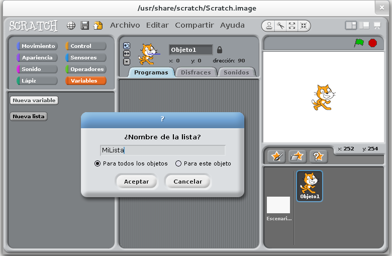
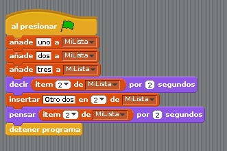

# Listas

En la vida cotidiana resulta bastante intuitivo lo que es una lista: Una enumeración de nombres, objetos o elementos como, por ejemplo, la famosa lista de los reyes godos:

"Ariarico,Aorico,Geberico,Alavivo,Fritigerno,Atanarico,Alarico I,..."

De modo similar, en Scratch las listas son variables que, en lugar de contener sólo un valor, pueden contener varios valores en sucesión.

De un modo bastante intuitivo, como una lista de la compra o una lista de discos más vendidos, los elementos de las listas tienen un orden implícito (del primero al último).

## Crear y eliminar listas

Para crear una lista se recurre al grupo de bloques "Variables" (el mismo que usamos anteriormente para las variables) y hacer click sobre el botón "Nueva lista".

Al hacerlo se nos mostrará un cuadro de diálogo en el que podemos indicar el nombre de la lista y, al igual que vimos en el caso de las variables, si se circunscribe al objeto o a todo el programa.

Si quisiéramos borrar la lista, sólo tendríamos que usar el botón "Borrar una lista" del mismo modo que vimos con las variables.

Como en el caso de las variables, al crear una lista aparecerán en la paleta nuevos bloques (piezas de puzzle) que nos permiten manipular los datos de esta.

## Añadir, eliminar, insertar y reemplazar elementos
Las listas se manipulan del mismo modo que las variables, añadiendo la complejidad de que contienen varios elementos que pueden añadirse, quitarse o modificarse independientemente. Los distintos bloques que corresponden a una lista nos permiten las siguientes acciones:

Añadir un elemento. El nuevo elemento se colocará al final de la lista, después del último que hubiera en ella. En la caja de texto (donde pone "cosa" por defecto) se escribe el contenido que se quiera que tenga el elemento añadido:

Borrar un elemento de una posición determinada. Se puede elegir el principio den la lista, el final o una posición concreta indicada por su número (por defecto, viene marcado 1):

Del mismo modo, se puede insertar un elemento de una posición determinada. También se puede elegir el principio den la lista, el final o una posición concreta indicada por su número (que, por defecto, también viene marcado el 1). Al insertar un elemento en una posición, el que hubiera en ella lugar pasa a la posición siguiente, del mismo modo que todos los que le siguieran:

Y, por último, también se puede reemplazar un elemento de la lista, cambiando su valor anterior por otro nuevo:

Como pequeño ejercicio de cómo funcionan estas cosas juntas, con lo que sabemos ya deberíamos poder ver qué hace este programa de ejemplo:

##Acceso a elementos y existencia de elementos
Se puede acceder a los datos de las listas de un modo bastante parecido a como hemos visto para las variables y otros tipos de dato.

Para empezar, al crear una lista se crea un bloque con el mismo nombre que esa lista ("MiLista", en nuestro ejemplo). Se trata de una variable que contiene la lista completa de todos sus elementos, por su orden y separados por espacios en blanco.

También podemos acceder a un elemento concreto a través de su posición en la lista, por medio del bloque "item".

Y, por último, podemos averiguar cuántos elementos contiene la lista con "longitud", que nos retornará el número de items de esta.

 
Además de estos bloques, tenemos un bloque lógico (que, como recordaremos, nos retorna un valor de "cierto" o "falso") que nos sirve para averiguar si en una lista existe un determinad elemento:

 