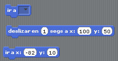
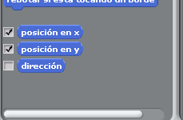

# Movimiento
Vamos a ver unas pequeñas nociones acerca del movimiento en los objetos de Scratch. Después de estas nociones vamos a ver todas las directivas que hay para el movimiento y ejemplos respectivos.

Así que pasemos a la introducción.

## Introducción
Debido a que Scratch es un programa orientado a enseñar a programar en los más jóvenes de la casa (que no es lo mismo que hacemos en este curso, enseñar al uso de la aplicación y los conceptos de la misma) el tema del movimiento es algo tan básico como el control de los objetos.

Para todo objeto debemos saber que se puede mover tanto de forma horizontal como vertical y además puede girar.

De la imagen podemos ver que los objetos tienen un área donde se pueden mover, y esta tiene dos ejes para indicar la posición de los objetos. Estos ejes son el eje X (el objeto se mueve en horizontal en este eje y que es la línea de color rojo) y el eje Y (el objeto se mueve de forma vertical en este eje y es la línea de color azul), el aspa donde se cruzan estos ejes es el punto de origen, el giro del objeto se representa por la dirección a donde apunta, es decir es la dirección hacia donde o desde donde se va a mover, por defecto esta dirección es de 90º.

Los objetos tienen unas variables implícitas de su posición como de su dirección. En la siguiente imagen podemos ver propiedades e información al respecto del objeto en cuestión:

Los botones **1, 2 y 3**:
* (1) Este botón habilita el giro en el objeto.
* (2) Este otro botón nos restringe a que el objeto sólo se refleje en horizontal.
* (3) Y este último botón restringe el giro del objeto de forma total.
Cuando habilitamos uno de estos 3 botones estamos deshabilitando la funcionalidad de los otros 2 botones como cabría esperar ya que la funcionalidad de cada botón es diferente y contraria a la de los otros dos.

Las etiquetas **4, 5 y 6**: 
* (4) La barra de color azul es una barra que podemos hacer click sobre ella para modificar manualmente la dirección del objeto, haciendo que gire el mismo.
* (5) Esta casilla nos permite ponerle al objeto un nombre para poder identificarlo. Una recomendación al respecto: Si existen más de 4 objetos en el escenario deberíamos de etiquetarlos todos de manera que sepamos que objeto es cada uno, ya que por cada objeto en el escenario su nombre por defecto es "Objeto X" donde X es un número y este identificador de objeto no es nada intuitivo.
* (6) Este candado nos permite bloquear/desbloquear el libre movimiento de un objeto para cuando ejecutemos el programa en un navegador web.

## Piezas
Al igual que en el apartado anterior de Control, tenemos este para el movimiento de objetos. Así tenemos todas estas piezas para mover objetos:

* **Mover el objeto**  
 
Cuando llegue el momento de hacer lo que esta pieza indica, el objeto se moverá un número de pasos, si el número que pongamos en la caja de la pieza es positivo el objeto se moverá hacia delante en donde apunta la dirección, si es negativo el número se moverá hacia atrás en esa misma dirección.   Un ejemplo sencillo es que la dirección del objeto sea de 90º, así que si ponemos 10 pasos se moverá hacia la derecha de forma totalmente horizontal o si son -10 pasos se moverá hacia la izquierda también de forma horizontal.

* **Giros**  
 
Dada la posición en la que se encuentre el objeto, este girará o bien en sentido horario o en sentido antihorario el número de grados indicados en la caja, es decir según hacia donde indique la flecha de la pieza. Al igual que con la pieza para dar pasos, podemos poner un número negativo y el objeto se moverá en sentido contrario a lo que indica la flecha de la pieza.  Es decir si el sentido es horario (la primera pieza) y la cantidad es negativa, el objeto girará en sentido antihorario.

* **Apuntar a...**  
 
Tenemos dos directivas que nos sirven para modificarle la dirección a los objetos, en la primera tenemos que indicar en la caja la graduación del giro, y en la segunda directiva podemos hacer que apunte hacia el puntero nuestro o bien hacia otro objeto de los que hay en el escenario.

* **Ir hacia...**  
 
Podemos también programar un objeto para que se dirija hacia la posición de nuestro puntero o bien hacia otro objeto que sería la primera pieza de las tres que aparecen en la imagen de este apartado. 
Con la tercera pieza le indicamos una posición concreta del escenario a donde se tiene que dirigir.  Y la segunda pieza lo que hace es una mezcla de la primera y la tercera, dejando un retardo indicado en segundos.

* **Modificar la posición**  
  
Las directivas de "fijar x a []" y "fijar y a []" hacen el mismo efecto que la directiva de "ir a x:[] y:[]" sólo que tenemos dividida esa directiva en dos para modificar las coordenadas individualmente. Las piezas de "cambiar x por []" y "cambiar y por []" tienen una función similar a las de fijar la posición, salvo que podemos hacer que cambie la posición del objeto en lugar de dejarla fija.

* **Bordes y movimiento**  
 
Usando esta pieza lo que conseguimos es que el objeto cuando toque un borde del área en la que se puede mover, este rebota en lugar de seguir su camino.

* **Displays**  
 
Los displays son cajas de información que podemos usar para mostrar las coordenadas y la dirección de un objeto, así podemos saber la trayectoria en todo momento del objeto.